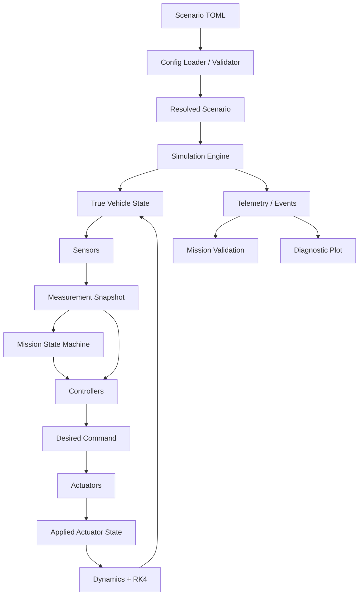

# Feature 15 — Polished README & Documentation

> **Project:** AstraLoop — Python Software-in-the-Loop Flight Control & Validation System  
> **Feature:** Polished README & Documentation  
> **Document path:** `docs/features/15-polished-readme-documentation.md`  
> **Status:** Implementation specification  
> **Primary goal:** Turn AstraLoop’s implemented behavior, architecture, numerical evidence, scenarios, artifacts, tests, limitations, and engineering lessons into a truthful, recruiter-readable public README and a concise source-of-truth documentation set that lets a reviewer understand, run, inspect, discuss, and continue the project without relying on undocumented knowledge.

---

## Scope Boundary

**[Confirmed]** The first screen of the public README should answer:

1. What is AstraLoop?
2. Why is it technically interesting?
3. What can I run right now?
4. What does success or failure look like?

**[Confirmed]** The README must include:

- a one-sentence explanation;
- a one-command demo;
- an architecture diagram;
- a nominal result;
- one fault result;
- a test command;
- major design decisions;
- known limitations.

**[Confirmed]** Required/recommended portfolio media includes:

- architecture diagram;
- nominal diagnostic plot;
- fault diagnostic plot;
- terminal PASS output;
- test-suite output;
- optional 20–40 second GIF or video showing command → result → plot.

**[Confirmed]** The project’s public positioning is:

> **The rocket is the domain. The hiring signal is the software engineering.**

**[Confirmed]** AstraLoop is a local Python software-in-the-loop flight-control and validation project, not:

- a SaaS;
- a cloud service;
- a Starship replica;
- a hardware project;
- a scripted animation;
- a high-fidelity aerospace simulator;
- a machine-learning project;
- a UI-first product.

**[Confirmed]** The repository should expose a clean documentation map including:

```text
README.md
AGENTS.md
docs/PROJECT_BRIEF.md
docs/ARCHITECTURE.md
docs/FEATURE_INDEX.md
docs/ROADMAP.md
docs/BUILD_LOG.md
docs/DEMO_SCRIPT.md
docs/INTERVIEW_STORY.md
docs/TESTING_STRATEGY.md
docs/NUMERICAL_VERIFICATION.md
docs/features/
```

**[Confirmed]** `README.md` is the public-facing project story.

**[Confirmed]** `AGENTS.md` is the concise Codex/implementation guidance document.

**[Confirmed]** Important decisions, bugs, and lessons should be recorded in `docs/BUILD_LOG.md`.

**[Confirmed]** Documentation should preserve these architecture truths:

- controller receives simulated measurements, not perfect truth;
- fixed simulation tick, not wall-clock time;
- project-owned RK4 in production;
- SciPy reference only in numerical verification;
- configuration-driven scenarios and faults;
- requested versus actual actuation;
- structured telemetry and validation;
- no scenario-name behavior branches;
- no database/network service requirement.

**[Confirmed]** Documentation must use measured, implemented facts.

Do not invent:

- final test count;
- exact runtime;
- exact numerical error;
- observed RK4 order;
- line count;
- number of checks;
- resume percentages;
- performance claims;
- scenario outcomes;
- screenshots of behavior that does not exist.

**[Decision]** Feature 15 owns the **repository documentation, evidence packaging, and portfolio communication layer**.

It owns:

- public README structure and content;
- README visual hierarchy;
- architecture diagram;
- quick-start commands;
- scenario table;
- nominal/fault evidence;
- run-artifact explanation;
- test/quality-gate documentation;
- key design decisions;
- known limitations and non-goals;
- future improvements;
- documentation map;
- setup/reset/troubleshooting instructions;
- screenshot and media requirements;
- screenshot file naming and placement;
- alt text and accessibility;
- demo script;
- interview story;
- build-log process;
- numerical-verification report linkage;
- AGENTS.md scope and synchronization;
- feature index/status accuracy;
- roadmap completion/status updates;
- truthful resume/portfolio bullet templates;
- documentation-review checklist;
- automated/manual documentation quality tests.

It does **not** own:

- implementing missing runtime behavior;
- changing scenario outcomes to look better;
- producing fabricated numerical evidence;
- writing fake screenshots;
- creating a hosted website;
- building a marketing landing page;
- adding a documentation framework;
- deploying cloud documentation;
- creating long-form aerospace theory lessons;
- duplicating all feature specifications in README;
- replacing source code comments with prose;
- adding new project features merely to improve the story.

---

# 1. Feature Overview

## Feature name

**Polished README & Documentation**

---

## One-sentence description

**[Decision]** Create a concise recruiter-facing README and a synchronized technical documentation package that explains what AstraLoop proves, runs from one command, shows real nominal and fault evidence, documents architecture and numerical decisions, exposes tests and artifacts, states limitations honestly, and gives Codex and reviewers one reliable source of truth.

---

## Detailed description

AstraLoop can be technically strong and still fail as a portfolio project if the repository makes the reviewer work too hard.

The documentation must support three review depths:

```text
Depth 1 — 15 to 30 seconds
Understand the project title, one-sentence value, visual result,
and one-command demo.

Depth 2 — 60 to 90 seconds
Understand the architecture, nominal/fault comparison,
objective validation, tests, and artifact outputs.

Depth 3 — 10 to 30 minutes
Inspect module boundaries, numerical verification,
scenario definitions, test strategy, tradeoffs, bugs, and lessons.
```

The documentation system is:

```text
README.md
  recruiter / hiring-manager entry point
        |
        +--> real screenshots / plot / demo
        +--> one-command run
        +--> architecture summary
        +--> nominal vs fault evidence
        +--> tests / numerical evidence
        +--> decisions / limitations
        +--> documentation map
                    |
                    v
docs/
  technical source-of-truth documents
        |
        +--> PROJECT_BRIEF
        +--> ARCHITECTURE
        +--> FEATURE_INDEX
        +--> ROADMAP
        +--> TESTING_STRATEGY
        +--> NUMERICAL_VERIFICATION
        +--> DEMO_SCRIPT
        +--> INTERVIEW_STORY
        +--> BUILD_LOG
        +--> features/01–15 specifications
                    |
                    v
AGENTS.md
  concise Codex constraints, commands, and architecture rules
```

---

## Documentation audiences

### Recruiter

Needs to identify quickly:

- Python;
- systems/simulation work;
- autonomous control;
- fault injection;
- automated testing;
- deterministic behavior;
- strong visual/demo evidence;
- relevance to software internships.

The recruiter should not need to understand every equation.

---

### Hiring manager

Needs evidence of:

- finishable scope;
- modular architecture;
- testability;
- deterministic execution;
- failure handling;
- objective outcomes;
- thoughtful tradeoffs;
- readable repository structure.

---

### Technical interviewer

Needs enough detail to ask about:

- truth versus measurement;
- RK4 and timestep selection;
- sensor delay/freeze;
- PID state and actuator lag;
- mission-state transitions;
- fault timing;
- telemetry alignment;
- expected failure scenarios;
- numerical verification;
- real bugs and lessons.

---

### Future contributor / Codex

Needs:

- current source-of-truth docs;
- exact commands;
- non-negotiable architecture rules;
- current feature status;
- files to read before coding;
- tests required for a change;
- explicit things not to add.

---

## Documentation principle: evidence before claims

A strong sentence is supported by one or more of:

```text
source code
committed scenario
automated test
generated artifact
measured verification result
documented design decision
```

Examples:

### Supported

> “The controller receives `MeasurementSnapshot`, not `VehicleState`.”

Supported by:

- architecture;
- public API;
- architecture test.

### Supported after implementation

> “The nominal mission lands within the project’s 2.0 m/s, 5 m, and 5° limits.”

Supported by:

- committed nominal scenario;
- `ValidationResult`;
- scenario test;
- summary artifact.

### Unsupported until measured

> “RK4 achieves 3.99 observed order with a maximum vehicle-state error of X.”

This must not appear until Feature 13 produces measured values.

---

## Documentation principle: public summary, technical depth elsewhere

README should not become a 10,000-line implementation specification.

**[Decision]** README summarizes:

- problem;
- solution;
- evidence;
- decisions;
- commands;
- structure;
- limitations.

Detailed contracts belong in `docs/`.

A reviewer should be able to follow links for depth without seeing repeated walls of text.

---

## Documentation principle: no unfinished-looking public surface

Feature specifications may contain `[Open Question]`.

The final public README should not display unresolved implementation placeholders as if the project is complete.

Allowed during build:

```text
[Screenshot placeholder]
[Measured value pending Feature 13]
```

Portfolio-ready README:

- replaces required placeholders;
- removes unimplemented feature claims;
- labels optional/future work clearly;
- uses current scenario outcomes.

---

## Priority

**P0/P1 — Required portfolio completion layer**

Documentation does not replace functioning software.

However, the project is not portfolio-ready until the reviewer can understand and reproduce it.

---

## Complexity

**Medium**

Writing is not the main difficulty.

The difficulty is:

- selecting evidence;
- avoiding overclaiming;
- keeping multiple docs synchronized;
- maintaining a fast reviewer path;
- preserving enough technical depth;
- replacing placeholders with real outputs.

---

# 2. Public README Requirements

## Required title block

Recommended:

```markdown
# AstraLoop

> **Python Software-in-the-Loop Flight Control & Validation System**

AstraLoop is a local Python simulation and validation system for a
simplified 2D reusable launch vehicle, where autonomous flight software
controls numerically simulated physics using imperfect sensor
measurements and is tested against reproducible nominal and
fault-injected missions.
```

Then:

```markdown
> **Portfolio positioning:** The rocket is the domain.
> The hiring signal is the software engineering.
```

---

## Required first-screen content

Before a reviewer scrolls deeply, include:

1. title/subtitle;
2. one-sentence explanation;
3. hero image or compact media;
4. three to five engineering highlights;
5. one-command demo.

Recommended highlights:

```text
deterministic fixed-step simulation
controller uses imperfect measurements, not truth
reproducible fault scenarios
objective mission validation
layered pytest verification
```

---

## Hero media decision

**[Decision]** The default hero visual should be:

```text
nominal diagnostic plot
```

or a carefully composed nominal/fault comparison image.

### Why not terminal-only hero

The plot communicates:

- physical trajectory;
- software measurements;
- commands;
- actuator response;
- mission phases;
- fault timing.

### Why not a cinematic rocket image

It would weaken the engineering signal and may imply visual fidelity that the project does not have.

---

## README badge policy

Recommended badges only after they are real:

- Python version;
- test/quality workflow status;
- license, if one is selected.

Avoid:

- dozens of decorative badges;
- fake coverage;
- package-download counts;
- cloud/deployment badges;
- “AI-powered” labels;
- unmeasured performance claims.

**[Open Question]** Whether to include any badges before a public GitHub repository/CI exists.

---

## README table of contents

For a medium-length README, use a concise contents list:

```text
Demo
Why This Project Exists
How It Works
Scenarios
Run Artifacts
Quick Start
Testing
Numerical Verification
Design Decisions
Repository Structure
Limitations
Documentation
```

Do not list every small subsection.

---

## Required README section order

Recommended final order:

```text
# AstraLoop
hero / highlights / quick command

## Demo
## Why This Project Exists
## How It Works
## Scenarios and Expected Outcomes
## Run Artifacts
## Quick Start
## Testing and Quality
## Numerical Verification
## Key Design Decisions
## Repository Structure
## Known Limitations and Non-Goals
## Future Improvements
## Documentation Map
## What I Learned
## Portfolio / Resume Notes (optional, usually outside README)
## License (if selected)
```

---

# 3. Demo Section

## Purpose

The demo section proves that the project runs and produces inspectable evidence.

Required content:

- nominal CLI screenshot;
- nominal diagnostic plot;
- one fault diagnostic plot or nominal/fault comparison;
- optional short GIF/video;
- actual commands.

---

## Required media files

Recommended path:

```text
docs/assets/
├── nominal-terminal.png
├── nominal-flight-plot.png
├── fault-terminal.png
├── fault-flight-plot.png
├── test-suite.png
├── architecture-overview.svg or .png
└── demo.gif                 # optional
```

Alternative:

```text
docs/images/
```

**Decision:** Choose one directory and use it consistently.

Recommended:

```text
docs/assets/
```

---

## Required screenshot set

### 1. Nominal terminal result

Must show:

- `SCENARIO PASS`;
- actual outcome;
- expected outcome;
- final state;
- core landing metrics;
- artifact directory.

Crop out:

- unrelated desktop;
- private username/path where practical;
- old commands;
- excessive empty terminal space.

---

### 2. Nominal diagnostic plot

Must be generated by Feature 11 from the committed nominal scenario.

Do not hand-edit plotted data.

Minor image compression/cropping is acceptable if it does not alter content.

---

### 3. Fault result

Choose the strongest stable scenario.

Recommended likely candidate:

```text
altimeter_freeze
```

because it can show:

- fault marker;
- truth/measurement divergence;
- stale data;
- state-machine reaction;
- expected outcome.

The final selection must be based on the finished scenarios.

---

### 4. Test-suite output

Must show a real successful command.

Prefer:

```text
uv run pytest
```

or the concise final test summary.

Do not fabricate test count.

The screenshot date/count should be refreshed near portfolio release.

---

### 5. Architecture diagram

Can be:

- Mermaid diagram rendered in README;
- committed SVG/PNG;
- both.

---

## Optional GIF/video

Recommended duration:

```text
20–40 seconds
```

Sequence:

1. run nominal command;
2. terminal result appears;
3. open generated diagnostic plot;
4. optionally run one fault scenario.

Avoid:

- long cinematic intro;
- music dependence;
- dramatic visual effects;
- hidden cuts that imply fake execution;
- unreadably fast terminal;
- personal/private desktop information.

---

## GIF fallback

README must remain useful without animation.

Every GIF/video requires:

- static poster/hero image;
- descriptive alt text;
- commands in text;
- result summary in text.

---

## Media size

Keep repository assets practical.

Recommendations:

- crop tightly;
- compress PNGs without damaging text;
- keep GIF short;
- prefer linked external video over a huge committed video file;
- do not commit many full run directories.

No hard size number until actual images exist, but avoid multi-hundred-megabyte repository media.

---

## Alt text

Every image must have descriptive alt text.

Bad:

```markdown

```

Good:

```markdown
![AstraLoop nominal mission diagnostic plot showing trajectory,
altitude, vertical velocity, pitch, throttle, gimbal, and mission phases]
(...)
```

Alt text should describe purpose, not every pixel.

---

# 4. Why This Project Exists

## Required framing

Recommended:

> AstraLoop demonstrates how to turn a stateful, numerical, failure-prone system into deterministic, testable Python software.

Then explain that it is intentionally not:

- SaaS;
- UI-first;
- scripted;
- perfect-state control;
- overbuilt 6-DOF research.

---

## Job-role alignment

Required:

```text
Primary target:
Software Engineering Intern — Systems / Simulation / Validation
```

Secondary:

- software test/validation;
- modeling and simulation;
- systems software;
- hardware-adjacent software.

Do not imply direct aerospace expertise or employment qualification beyond the software evidence.

---

## Skills demonstrated

README should list concise skills:

- Python 3.13;
- NumPy;
- numerical methods;
- closed-loop control;
- state machines;
- sensor/actuator modeling;
- fault injection;
- deterministic simulation;
- telemetry;
- objective validation;
- pytest;
- Ruff/Pyright;
- Matplotlib;
- technical documentation.

---

## Project story

Recommended problem statement:

> How can autonomous control software be tested without physical hardware?

Approach:

> Build a deterministic software-in-the-loop environment with numerical physics, imperfect sensors, actuator dynamics, explicit mission states, reproducible faults, telemetry, and automated acceptance checks.

---

# 5. How It Works / Architecture

## Required architecture statement

AstraLoop uses:

```text
functional core + imperative shell
```

Explain briefly.

Functional core:

- derivatives;
- RK4;
- validation checks;
- conversions;
- transition predicates.

Imperative shell:

- tick;
- truth state;
- sensor buffers/RNG;
- controller memory;
- actuator state;
- mission state;
- faults;
- telemetry.

---

## Required truth/measurement separation

This is the main architecture diagram/message.

Required wording:

> The controller and mission logic do not receive perfect simulator truth. Sensor models transform truth into software-visible measurements that may include noise, bias, delay, freeze, or stale status.

---

## Required diagram

Recommended Mermaid:



Include fault connections:

```text
Fault Manager -> Sensors
Fault Manager -> Actuators
```

if the diagram remains readable.

---

## Diagram fallback

If Mermaid rendering is not guaranteed in the target portfolio surface, include a committed SVG/PNG.

README source should still contain a text explanation.

Do not require an external diagram service at runtime.

---

## Deterministic clock section

Required:

```python
sim_time = tick * dt
```

Explain that this clock defines:

- sensor sampling;
- delay;
- controller updates;
- actuator dynamics;
- mission transitions;
- faults;
- telemetry.

State explicitly:

```text
no sleep()
no wall-clock physics
```

---

## Tick-order documentation

README may summarize the flow.

Full exact ordering belongs in `docs/ARCHITECTURE.md`.

Link to it.

Do not duplicate every tick detail if it makes README too long.

---

## Architecture decision table

Recommended:

| Decision | Why |
|---|---|
| Python-first | Target role and project emphasis |
| 2D planar instead of 6-DOF | Technical depth with finishable scope |
| Fixed-step RK4 | Shared deterministic continuous/discrete clock |
| SciPy reference only | Independent verification without adaptive runtime scheduling |
| Controller receives measurements | Prevents a fake closed loop |
| TOML scenarios | Readable and reproducible |
| CSV/JSON/PNG artifacts | Inspectable without a database |
| No web/database | Keeps signal on simulation/validation |
| Dedicated RNG streams | Reproducibility and isolation |
| One diagnostic figure | Strong visual evidence without GUI scope |

---

# 6. Scenarios and Expected Outcomes

## Required scenario table

README includes the committed scenarios.

Recommended columns:

```text
Scenario
Fault
Purpose
Expected Outcome
```

Rows:

```text
nominal
altimeter_freeze
velocity_bias
sensor_delay
degraded_actuator
```

Do not fill final expected outcomes until tuned/committed.

Example structure:

| Scenario | Fault | Purpose | Expected outcome |
|---|---|---|---|
| `nominal` | None | Baseline autonomous mission | `PASS` |
| `altimeter_freeze` | Altimeter freeze | Prove stale-data handling | `<measured/configured>` |

---

## Expected failure explanation

README must explain:

```text
mission outcome
≠
scenario regression result
```

Example:

```text
Actual mission outcome: CONTROLLED_ABORT
Expected outcome:       CONTROLLED_ABORT
Scenario result:        PASS
```

This is a major software-validation concept.

---

## Scenario links

Each scenario name should link to its TOML file.

This helps reviewers inspect:

- seed;
- timing;
- fault definition;
- limits;
- expected outcome.

---

## Stable seeds

State:

> Every stochastic scenario includes an explicit seed, and the fully resolved configuration is saved with the run artifacts.

---

# 7. Run Artifacts

## Required artifact tree

```text
runs/
└── <scenario_id>/
    └── <utc-timestamp>-<config-digest>/
        ├── telemetry.csv
        ├── events.json
        ├── resolved_config.json
        ├── summary.json
        └── flight_plot.png
```

---

## File explanations

### `telemetry.csv`

Tick-aligned:

- truth;
- measurements;
- statuses/ages;
- mission state;
- commands;
- actuation;
- active faults.

### `events.json`

Ordered:

- simulation lifecycle;
- mission transitions;
- fault activation/deactivation.

### `resolved_config.json`

Exact normalized configuration and digest.

### `summary.json`

Actual/expected outcome, metrics, checks, final state, faults.

### `flight_plot.png`

Static diagnostic figure.

---

## Artifact immutability

Mention that each run creates a new directory and does not overwrite earlier runs.

Do not over-explain staging internals in README.

Link architecture/feature docs for details.

---

## Example artifacts policy

**Decision]** Do not commit all generated `runs/`.

Options:

1. commit only screenshots under `docs/assets/`;
2. optionally commit one small curated example bundle under:

```text
docs/example-run/
```

or:

```text
examples/nominal-run/
```

Only if it materially helps reviewers and stays small.

### Recommendation

Use screenshots plus scenario files for MVP.

Avoid committing large CSV histories.

---

# 8. Quick Start / Local Setup

## One setup path

**[Decision]** Document only the `uv` workflow.

Do not maintain parallel primary instructions for:

- pip;
- Poetry;
- Conda;
- virtualenv;
- Docker.

A contributor can adapt, but the README has one tested route.

---

## Requirements

```text
Git
uv
```

No:

- Docker;
- database;
- API key;
- cloud account;
- external hardware;
- `.env`.

---

## Setup commands

```bash
git clone <repository-url>
cd astraloop

uv python install 3.13
uv sync --all-groups
```

`uv.lock` is committed.

---

## Run commands

```bash
uv run astraloop list-scenarios
uv run astraloop run scenarios/nominal.toml
uv run astraloop run scenarios/altimeter_freeze.toml
```

Equivalent module:

```bash
uv run python -m astraloop run scenarios/nominal.toml
```

---

## No-artifact command

Optional developer command:

```bash
uv run astraloop run scenarios/nominal.toml --no-artifacts
```

Explain briefly.

---

## Reset local state

There is no database.

To reset:

```text
delete generated directories under runs/
keep runs/.gitkeep
```

No migration or seed command.

---

## Windows/macOS/Linux

`uv` commands are cross-platform.

Avoid shell-specific activation instructions because `uv run` does not require manual activation.

If a known Windows issue appears, document it in troubleshooting after reproducing it.

---

# 9. Testing and Quality Documentation

## Required commands

```bash
uv run pytest
uv run pytest tests/unit
uv run pytest tests/integration
uv run pytest tests/scenarios
uv run pytest tests/numerical

uv run ruff check .
uv run ruff format --check .
uv run pyright
```

---

## Required quality gate

```bash
uv run ruff check .
uv run ruff format --check .
uv run pyright
uv run pytest
```

---

## Test-layer explanation

Concise:

- unit tests;
- numerical verification;
- integration tests;
- scenario regression tests;
- architecture contract tests;
- artifact/failure-path tests.

---

## Test count policy

Display a test count only after running the final suite.

Prefer an automatically refreshed screenshot/badge or measured release note.

Do not hard-code a count likely to go stale unless a release process updates it.

---

## Test screenshot

Must show a real passing test run.

Do not crop away warnings/errors if they exist.

The portfolio release requires:

```text
no unexpected warnings
```

---

## CI documentation

If a minimal GitHub Actions workflow exists:

- show status badge;
- link workflow;
- state the same commands run locally.

If CI does not exist, do not display a fake badge.

---

# 10. Numerical Verification Documentation

## Required README summary

Explain:

- custom RK4 in production;
- analytical convergence tests;
- SciPy `solve_ivp` reference;
- fixed-step reason;
- supported timestep based on measured evidence.

---

## Required link

```text
docs/NUMERICAL_VERIFICATION.md
```

---

## Measured-value policy

Do not write final values until tests produce them.

Portfolio-ready documentation should replace placeholders with:

- observed order range/table;
- reference method;
- reference tolerance;
- selected production `dt`;
- max component errors;
- tested envelope.

---

## Honest language

Good:

> “The selected timestep was verified for the documented project parameter and scenario envelope.”

Bad:

> “The solver is universally stable and aerospace-grade.”

---

# 11. Key Design Decisions

## Required decisions

README should summarize at least:

1. 2D instead of 6-DOF;
2. truth separated from measurements;
3. deterministic tick clock;
4. project-owned RK4;
5. SciPy reference only;
6. config-driven scenarios/faults;
7. immutable file artifacts instead of database;
8. headless core + separate plotting;
9. expected failures as valid regression outcomes;
10. framework-light Python architecture.

---

## Decision format

Use concise table or bullets.

Every decision includes:

```text
choice
reason
tradeoff
```

Example:

> **2D planar dynamics:** enough coupled translational/rotational behavior to demonstrate numerical and control software, while remaining finishable and testable. It does not claim 6-DOF fidelity.

---

# 12. Known Limitations and Non-Goals

## Required limitations

- simplified planar 2D dynamics;
- simplified gravity/thrust/mass model;
- no high-fidelity aerodynamics/atmosphere;
- no orbital mechanics;
- no multi-stage vehicle;
- classical control;
- no full navigation/state estimator in MVP;
- no hardware-in-the-loop;
- no real-time guarantee;
- no 3D rendering;
- no real vehicle certification;
- project-defined parameters/limits;
- no database/web/cloud/multi-user behavior.

---

## Why limitations increase credibility

A technical portfolio is stronger when it states:

```text
what was intentionally modeled
what was intentionally omitted
where accuracy evidence applies
```

Avoid apologetic wording.

Use:

> “This is intentionally a simplified software-validation testbed.”

---

## Non-goals

Explicit:

- Starship replica;
- real flight-control deployment;
- launch guidance;
- real rocket instructions;
- commercial product;
- SaaS;
- authentication/payment;
- ML control;
- photorealistic simulator.

---

# 13. Future Improvements

## Policy

Only list improvements that follow naturally from the current architecture.

Recommended:

- Monte Carlo campaigns;
- compound faults;
- wind/disturbance profiles;
- lightweight state estimation;
- comparative reports;
- replay GIF;
- run-to-run regression visualization;
- controller tuning experiments;
- performance benchmark command;
- optional desktop UI;
- experimental 3D/6-DOF branch.

---

## Avoid promising roadmap dates

Do not imply future work is guaranteed.

Do not let future improvements overshadow the finished MVP.

---

# 14. Repository Structure Documentation

## Required tree

README includes a concise tree:

```text
project-root/
├── README.md
├── AGENTS.md
├── pyproject.toml
├── uv.lock
├── docs/
├── scenarios/
├── src/astraloop/
├── tests/
└── runs/
```

Then list major source packages.

Avoid a tree containing every file if it becomes unreadable.

Full package tree belongs in architecture docs.

---

## Source package descriptions

Brief:

```text
config       TOML schema/resolution
model        shared domain records
simulation   dynamics, RK4, engine
sensors      software-visible measurements
control      PID/control laws
actuators    limits/lag/degradation
mission      states and transition guards
faults       deterministic fault lifecycle/effects
telemetry    capture, serialization, plotting
validation   objective post-run checks
scenarios    application runner/discovery
```

---

# 15. Documentation Map and Source-of-Truth Policy

## `README.md`

Audience:

```text
recruiter / reviewer / contributor entry point
```

Owns:

- concise story;
- demo;
- quick start;
- architecture overview;
- evidence;
- limitations;
- doc links.

Does not own exhaustive implementation contracts.

---

## `AGENTS.md`

Audience:

```text
Codex / coding agents / contributors
```

Owns:

- project summary;
- goal;
- read-before-coding order;
- repo/source structure;
- primary commands;
- coding conventions;
- architecture rules;
- testing expectations;
- definition of done;
- prohibited scope.

Keep concise enough to be read before every coding session.

Do not paste all 15 feature specs into it.

---

## `docs/PROJECT_BRIEF.md`

Owns:

- final project direction;
- target role;
- success criteria;
- non-goals;
- portfolio positioning.

Changes rarely.

---

## `docs/ARCHITECTURE.md`

Owns:

- final stack;
- module/data flow;
- tick ordering;
- truth boundary;
- state ownership;
- public data contracts;
- error taxonomy;
- artifact architecture;
- major tradeoffs.

Any architecture change updates this file and tests.

---

## `docs/FEATURE_INDEX.md`

Owns:

- numbered feature list;
- status;
- dependencies;
- links to specs;
- implementation/verification state.

Recommended statuses:

```text
Not Started
In Progress
Implemented
Verified
Documented
```

Avoid percentages without a defined rubric.

---

## `docs/ROADMAP.md`

Owns:

- build phases;
- sequencing;
- milestone gates;
- scope cuts.

After completion, update it to show actual completion rather than leaving every item as planned.

---

## `docs/TESTING_STRATEGY.md`

Owns concise test philosophy and commands.

Detailed Feature 12 spec remains in `docs/features/12-automated-tests.md`.

---

## `docs/NUMERICAL_VERIFICATION.md`

Owns measured Feature 13 evidence.

No fabricated tables.

---

## `docs/BUILD_LOG.md`

Owns chronological:

- decisions;
- bugs;
- fixes;
- lessons;
- measured milestones.

Recommended entry:

```markdown
## YYYY-MM-DD — <short title>

### Context
### Decision / Bug
### Evidence
### Fix
### Lesson
### Related tests / files
```

---

## `docs/DEMO_SCRIPT.md`

Owns:

- 60–90 second recruiter demo;
- 3–5 minute technical demo;
- commands;
- what to point at;
- fallback if live run fails.

---

## `docs/INTERVIEW_STORY.md`

Owns:

- problem/approach/result;
- major decisions;
- hardest bugs;
- numerical verification explanation;
- expected failure semantics;
- future extension answers;
- truthful resume bullet templates.

---

## `docs/features/`

Owns the detailed feature specifications.

These are implementation planning/reference documents, not the first recruiter surface.

---

## `features/` and `tickets/`

The existing repository documentation package may include implementation feature/ticket files.

**Decision]** Keep one clear convention.

If `docs/features/` becomes the feature-spec source of truth, do not maintain conflicting duplicates under top-level `features/`.

**[Open Question]** Whether to migrate/remove top-level planning folders after implementation.

Avoid breaking useful planning history without an explicit cleanup decision.

---

# 16. README Evidence Sections

## Nominal result

Required content:

- actual outcome;
- expected outcome;
- final state;
- three core metrics;
- screenshot/plot;
- command.

Values must come from the current committed scenario/result.

---

## Fault result

Required content:

- fault type/target;
- activation timing;
- visible effect;
- final actual outcome;
- expected outcome;
- scenario result;
- screenshot/plot;
- command.

---

## Side-by-side comparison

Recommended presentation:

| Nominal | Fault scenario |
|---|---|
| plot/image | plot/image |
| actual PASS | actual controlled abort/fail/pass |
| no fault | fault activated |
| core metrics | expected result |

GitHub Markdown images can be placed in a two-column table.

Ensure alt text still works.

---

## Do not cherry-pick misleading runs

Use the committed scenario and seed.

Do not run repeatedly until a random result looks best.

If stochastic behavior exists, the committed explicit seed makes the evidence reproducible.

---

# 17. What I Learned / Engineering Lessons

## Required content

At least two or three real lessons after implementation.

Potential categories:

- pitch/thrust sign convention;
- delay-buffer off-by-one;
- PID saturation/windup;
- transition threshold chattering;
- fault timing order;
- telemetry frame alignment;
- touchdown-frame selection;
- timestep instability;
- reference-solver segmentation;
- expected failure taxonomy.

---

## Lesson format

Recommended:

```text
Problem
Why it was difficult
How telemetry/tests exposed it
Fix
Permanent regression test
```

This is more credible than:

> “Everything went smoothly.”

---

## Build log source

README lessons should summarize real `BUILD_LOG.md` entries.

Do not invent bugs merely to make the story interesting.

---

# 18. Demo Script Requirements

## 60–90 second script

Recommended:

### 0–15 seconds

Show README hero/diagram.

Say:

> “AstraLoop is a local Python software-in-the-loop validation system. The controller only sees simulated measurements, not perfect truth.”

### 15–40 seconds

Run nominal:

```bash
uv run astraloop run scenarios/nominal.toml
```

Point to:

- scenario PASS;
- landing metrics;
- artifact path.

### 40–65 seconds

Open plot or show pre-generated plot.

Point to:

- trajectory;
- measured versus truth;
- requested versus actual actuation;
- mission phases.

### 65–90 seconds

Run/show fault scenario.

Point to:

- fault activation;
- changed measurement/response;
- expected actual outcome;
- same runner used by pytest.

---

## Technical 3–5 minute script

Add:

- tick order;
- state machine;
- fault config;
- telemetry event;
- numerical verification;
- test suite;
- one bug/lesson.

---

## Live demo fallback

If a live run fails due to environment/setup:

- use committed screenshots;
- show commands;
- show artifacts;
- do not pretend the live command succeeded.

Document setup verification before interviews.

---

# 19. Interview Story Requirements

## Problem

How to validate autonomous flight software without hardware.

---

## Approach

- deterministic 2D physics;
- sensor imperfections;
- controller;
- actuator lag;
- mission state machine;
- fault injection;
- telemetry;
- objective validation;
- tests.

---

## Main decisions

Use the project’s actual decisions.

---

## Hardest technical areas

Select only real implemented difficulties.

---

## Results

Use truthful measured facts:

- scenario count;
- fault count;
- test count;
- validation limits;
- measured numerical order/error;
- run-artifact files.

Do not exaggerate.

---

## Resume bullet template

Only after implementation:

> Built AstraLoop, a Python software-in-the-loop flight-control validation system using a deterministic fixed-step RK4 engine, imperfect sensor/actuator models, and configuration-driven fault scenarios; added `<measured test count>` automated tests and objective mission validation across `<measured scenario count>` reproducible scenarios.

Replace placeholders only with real measured values.

Alternative without test count:

> Built a deterministic Python software-in-the-loop validation system integrating numerical 2D dynamics, simulated sensors, closed-loop control, actuator lag, mission states, fault injection, telemetry, and automated scenario acceptance tests.

---

# 20. Documentation Style Guide

## Tone

- technical;
- direct;
- confident where evidence exists;
- honest about limits;
- recruiter-readable;
- no startup marketing language;
- no exaggerated aerospace language.

---

## Terminology

Use consistently:

```text
software-in-the-loop
simulation truth
software-visible measurement
desired command
applied actuator state
mission state
fault activation
actual outcome
expected outcome
scenario result
run artifact
```

Avoid swapping terms casually:

```text
estimated state
measured state
sensor state
```

unless the relevant data model uses that term.

---

## Units

Always include units for physical values.

Internal angles:

```text
radians
```

Human reporting:

```text
degrees where readable
```

State both where necessary.

---

## Capitalization

Use stable names:

```text
AstraLoop
VehicleState
MeasurementSnapshot
ControlCommand
ActuatorState
MissionState
SimulationError
ConfigError
```

Scenario IDs remain lowercase code formatting.

---

## Code blocks

Every command must be copy/pasteable.

Do not include shell prompts such as:

```text
$
>
```

unless necessary to explain platform behavior.

---

## Links

Use relative repository links.

Examples:

```markdown
[Architecture](docs/ARCHITECTURE.md)
[Nominal scenario](scenarios/nominal.toml)
```

Avoid absolute local machine paths.

---

## Markdown tables

Use for concise comparisons.

Do not use huge tables with long paragraphs.

---

## Heading depth

Prefer:

```text
H1 title
H2 major section
H3 focused subsection
```

Avoid H5/H6 nesting.

---

## Emoji

Optional and minimal.

Do not depend on emoji for meaning.

The engineering tone should not look like a social-media post.

---

## Generated content labels

If a screenshot or table is generated from a particular scenario/commit, optionally note:

```text
Generated from scenarios/nominal.toml, seed 42.
```

This improves reproducibility.

---

# 21. Documentation Freshness and Synchronization

## Update triggers

Documentation must be updated when:

- public command changes;
- scenario file changes;
- expected outcome changes;
- validation limit changes;
- artifact schema/file changes;
- architecture boundary changes;
- project structure changes;
- test commands change;
- production `dt` changes;
- numerical evidence changes;
- a feature status changes;
- a limitation is removed/added.

---

## Source-of-truth rule

When two documents conflict:

1. production behavior/tests determine current fact;
2. architecture/config/result types determine technical contract;
3. update all conflicting docs in the same change.

Do not leave contradictory public and internal docs.

---

## Documentation review near release

Required release pass:

- run every documented command;
- replace screenshots;
- confirm relative links;
- confirm scenario outcomes;
- confirm test command;
- confirm test count if stated;
- confirm numerical numbers;
- confirm artifact tree;
- confirm file paths;
- remove placeholders;
- update roadmap/index/status.

---

## Placeholder policy

Allowed during implementation:

```text
<repository-url>
<measured value pending>
[Screenshot placeholder]
```

Portfolio-ready gate:

- no required screenshot placeholder;
- no unfilled measured result;
- no placeholder repository URL;
- no stale “future” claim for implemented behavior.

---

## Timestamp policy

Do not add “last updated” timestamps to every document unless maintained automatically.

Git history already tracks changes.

`BUILD_LOG.md` entries are dated.

---

# 22. Documentation Verification and Tests

## Automated tests

Feature 15 may add small, dependency-light checks.

Recommended:

```text
tests/architecture/test_documentation_contract.py
```

or:

```text
tests/docs/test_documentation.py
```

---

## Required command-presence checks

Assert README contains current canonical commands:

```text
uv sync --all-groups
uv run astraloop list-scenarios
uv run astraloop run scenarios/nominal.toml
uv run pytest
uv run ruff check .
uv run pyright
```

This protects accidental removal, not command correctness.

Command correctness is tested in Features 12/14.

---

## Required file-existence checks

Assert linked core docs exist:

```text
README.md
AGENTS.md
docs/PROJECT_BRIEF.md
docs/ARCHITECTURE.md
docs/FEATURE_INDEX.md
docs/ROADMAP.md
docs/BUILD_LOG.md
docs/DEMO_SCRIPT.md
docs/INTERVIEW_STORY.md
docs/TESTING_STRATEGY.md
docs/NUMERICAL_VERIFICATION.md
```

If a doc is intentionally not included, update the contract.

---

## Relative-link checker

A small Python test may parse Markdown relative links and verify target paths exist.

Avoid adding a full documentation-site framework.

Requirements:

- ignore external links;
- ignore anchors initially or validate simply;
- ignore links inside code blocks;
- report source file and broken target.

---

## Required asset checks

Portfolio-ready test/check should confirm required files exist:

```text
nominal-terminal.png
nominal-flight-plot.png
fault-flight-plot.png
test-suite.png
```

**Decision]** Do not enforce these before the final documentation phase unless placeholders are deliberately allowed.

Use a release/documentation check rather than blocking early feature development.

---

## Placeholder scan

Portfolio-release check scans public docs for:

```text
Screenshot placeholder
Demo placeholder
<repository-url>
<measured
TODO
TBD
```

Allow documented Open Questions in feature specs, but not unresolved placeholders in public README.

Scope scan to:

```text
README.md
docs/DEMO_SCRIPT.md
docs/INTERVIEW_STORY.md
docs/NUMERICAL_VERIFICATION.md
```

with explicit exceptions.

---

## Scenario synchronization test

README scenario table should be generated/checked against discovered scenario IDs or kept in a small explicit list.

**Decision]** Do not dynamically rewrite README during tests.

A test can verify each bundled scenario ID appears in README.

---

## Artifact tree synchronization test

A test can verify the README lists the five required artifact names.

---

## Architecture phrase test

A small test can verify README still states:

```text
controller does not receive perfect truth
```

But avoid brittle exact sentence matching.

Prefer checking load-bearing terms.

---

## Markdown linting

**[Decision]** Do not add a heavy Markdown linter unless real formatting problems arise.

Manual review plus small link/placeholder tests are sufficient for MVP.

---

## Spellcheck

Optional.

Do not add a large dictionary/config dependency solely for spellcheck.

Manual proofreading is required.

---

## Screenshot correctness

Cannot be fully automated.

Manual review must ensure:

- current CLI;
- current scenario;
- no misleading crop;
- readable resolution;
- no private information;
- no stale result.

---

# 23. Error and Edge Cases

## Documented command no longer works

This is a release-blocking documentation bug.

Fix command or docs before portfolio release.

---

## README claims a feature not implemented

Remove or label future work.

Do not leave it in core features.

---

## Screenshot shows old CLI

Replace it.

---

## Scenario outcome changes

Update:

- TOML expected outcome;
- tests;
- README scenario table;
- screenshot;
- demo script;
- interview story if referenced.

---

## Test count changes

Avoid hard-coded count or update release evidence.

---

## Numerical tolerance/result changes

Update numerical report and any README summary.

---

## Architecture changes

Update:

- architecture doc;
- diagram;
- AGENTS rules;
- architecture tests;
- README decision summary.

---

## Broken image link

Release check fails/manual review catches it.

---

## Large GIF

Compress, shorten, or link external video.

---

## Public path reveals private local username

Crop screenshot or display relative paths.

---

## No license selected

Do not claim one.

**[Open Question]** Choose a license before public release if the repository is intended to be reusable.

---

## No CI

Do not show CI badge.

---

## Docs too long

Move deep content to focused docs and link it.

---

## Docs too shallow

Ensure architecture, numerical verification, testing, limitations, and lessons exist.

---

## Feature specs include outdated plans

Update status or label them as historical planning documents.

Do not present planned values as final facts.

---

# 24. Acceptance Criteria

## AC-01 — README begins with project title and subtitle

**Given** public README  
**When** first lines are viewed  
**Then** `AstraLoop` and the software-in-the-loop subtitle are visible.

---

## AC-02 — README includes one-sentence description

**Given** first screen  
**When** read  
**Then** the reader understands the local 2D simulation/control/validation purpose.

---

## AC-03 — README states portfolio positioning

**Given** first section  
**When** inspected  
**Then** it explains that the rocket is the domain and software engineering is the hiring signal.

---

## AC-04 — First screen answers what can be run

**Given** README top section  
**When** viewed  
**Then** one nominal command is visible or immediately linked.

---

## AC-05 — First screen shows real visual evidence

**Given** portfolio-ready README  
**When** viewed  
**Then** a real diagnostic image/GIF is displayed rather than a placeholder.

---

## AC-06 — README contains no required screenshot placeholder at release

**Given** release state  
**When** placeholder scan runs  
**Then** none remains in public README.

---

## AC-07 — README explains why the project exists

**Given** Why section  
**When** read  
**Then** the systems/simulation/validation problem and portfolio goal are clear.

---

## AC-08 — README states target role honestly

**Given** target-role section  
**When** read  
**Then** systems/simulation/validation software internship alignment is visible without claiming professional aerospace certification.

---

## AC-09 — README lists major demonstrated skills

**Given** skill section  
**When** read  
**Then** Python, numerics, control, state machines, faults, telemetry, testing, and documentation are represented.

---

## AC-10 — README explicitly states non-SaaS/non-hardware scope

**Given** project framing  
**When** read  
**Then** the project is not presented as web/cloud/hardware product.

---

## AC-11 — README contains architecture diagram

**Given** How It Works section  
**When** rendered  
**Then** truth, sensors, measurements, mission/controller, actuators, dynamics, telemetry, and validation are visible.

---

## AC-12 — Diagram preserves truth/measurement separation

**Given** diagram  
**When** inspected  
**Then** controller has no direct perfect-truth input path.

---

## AC-13 — README states deterministic tick formula

**Given** architecture summary  
**When** read  
**Then** `sim_time = tick * dt` is shown.

---

## AC-14 — README explains no wall-clock delay

**Given** timing section  
**When** read  
**Then** sensor delay/fault/controller timing is simulation-time based and does not use sleep.

---

## AC-15 — README links full architecture document

**Given** architecture summary  
**When** deeper detail is desired  
**Then** a valid relative link to `docs/ARCHITECTURE.md` exists.

---

## AC-16 — README describes the fixed-step RK4 decision

**Given** design section  
**When** read  
**Then** deterministic hybrid timing is the reason, not trendiness.

---

## AC-17 — README describes SciPy as reference-only

**Given** numerical section  
**When** read  
**Then** `solve_ivp` is not presented as the production scheduler.

---

## AC-18 — README lists all bundled MVP scenarios

**Given** scenario section  
**When** read  
**Then** nominal, altimeter freeze, velocity bias, sensor delay, and degraded actuator are present.

---

## AC-19 — README scenario IDs link to files

**Given** scenario table  
**When** links are checked  
**Then** each committed scenario path exists.

---

## AC-20 — README expected outcomes match committed config

**Given** finished scenarios  
**When** table is reviewed  
**Then** displayed expectations agree with TOML and tests.

---

## AC-21 — README explains actual versus expected outcome

**Given** fault scenario explanation  
**When** read  
**Then** expected abort/failure can produce scenario PASS.

---

## AC-22 — README nominal evidence uses current committed seed/scenario

**Given** nominal result  
**When** reproduced  
**Then** screenshot/metrics match the committed scenario behavior.

---

## AC-23 — README fault evidence uses current committed scenario

**Given** selected fault example  
**When** reproduced  
**Then** fault timing/effect/outcome match current artifacts.

---

## AC-24 — README does not cherry-pick hidden random runs

**Given** displayed evidence  
**When** traced  
**Then** the explicit committed seed/config reproduces it.

---

## AC-25 — README lists all five run artifacts

**Given** artifact section  
**When** read  
**Then** telemetry, events, resolved config, summary, and plot are explained.

---

## AC-26 — Artifact directory structure is accurate

**Given** README tree  
**When** compared with Feature 09 output  
**Then** scenario/timestamp/digest organization matches.

---

## AC-27 — README does not imply a database

**Given** persistence section  
**When** read  
**Then** local files are the artifact model.

---

## AC-28 — README provides one tested setup path

**Given** Quick Start  
**When** read  
**Then** `uv` is the primary workflow and no conflicting manager is presented equally.

---

## AC-29 — README lists prerequisites

**Given** setup section  
**When** read  
**Then** Git and uv requirements are clear.

---

## AC-30 — README setup commands work in a clean clone

**Given** supported environment  
**When** commands are run  
**Then** dependencies install from committed lockfile.

---

## AC-31 — README nominal command works

**Given** installed environment  
**When** documented nominal command runs  
**Then** Feature 14 CLI executes successfully according to current scenario contract.

---

## AC-32 — README list-scenarios command works

**Given** installed environment  
**When** command runs  
**Then** bundled scenarios are shown.

---

## AC-33 — README fault command works

**Given** selected fault command  
**When** run  
**Then** scenario completes according to expected contract.

---

## AC-34 — README module invocation works if documented

**Given** alternative module command  
**When** run  
**Then** it uses the same CLI.

---

## AC-35 — README explains no database seed step

**Given** setup/demo-data section  
**When** read  
**Then** committed TOML scenarios are identified as demo data.

---

## AC-36 — README reset instructions are accurate

**Given** local reset section  
**When** followed  
**Then** deleting generated `runs/` content resets persistent state.

---

## AC-37 — README lists full pytest command

**Given** testing section  
**When** read  
**Then** `uv run pytest` is present.

---

## AC-38 — README lists focused test commands

**Given** testing section  
**When** read  
**Then** unit, integration, scenario, and numerical commands are available.

---

## AC-39 — README lists Ruff and Pyright commands

**Given** quality section  
**When** read  
**Then** lint, format check, and type-check commands are present.

---

## AC-40 — README test screenshot is real/current

**Given** portfolio release assets  
**When** inspected  
**Then** screenshot reflects a real passing current suite.

---

## AC-41 — README does not invent a test count

**Given** a stated test count  
**When** verified  
**Then** it matches the current measured suite; otherwise no count is claimed.

---

## AC-42 — README links numerical verification

**Given** numerical section  
**When** read  
**Then** valid link to `docs/NUMERICAL_VERIFICATION.md` exists.

---

## AC-43 — Numerical values are measured

**Given** README/report claims  
**When** compared with Feature 13 tests  
**Then** timestep/order/error values are real.

---

## AC-44 — Numerical limitations are stated

**Given** numerical section  
**When** read  
**Then** evidence is scoped to tested smooth/project envelope.

---

## AC-45 — README summarizes key design decisions

**Given** decision section  
**When** read  
**Then** at least the core ten architecture/scope choices are represented concisely.

---

## AC-46 — Decisions include reasons/tradeoffs

**Given** decision entries  
**When** read  
**Then** they are not bare technology lists.

---

## AC-47 — README includes known limitations

**Given** limitations section  
**When** read  
**Then** simplified 2D physics, no high-fidelity aerospace/real hardware, and project-value assumptions are explicit.

---

## AC-48 — README includes non-goals

**Given** scope section  
**When** read  
**Then** SaaS, 6-DOF MVP, ML, cloud, hardware, and Starship-replica scope are excluded.

---

## AC-49 — README future improvements are separated from current features

**Given** future section  
**When** read  
**Then** unimplemented work is not presented as available.

---

## AC-50 — README contains concise repository tree

**Given** project structure section  
**When** read  
**Then** major directories and source packages are understandable.

---

## AC-51 — Repository tree matches actual layout

**Given** current repository  
**When** compared  
**Then** documented paths exist or are explicitly planned/pre-implementation.

Portfolio-ready state requires actual agreement.

---

## AC-52 — Documentation map links all core docs

**Given** README documentation map  
**When** link checker runs  
**Then** every target exists.

---

## AC-53 — README remains reviewer-readable

**Given** a recruiter reading first sections  
**When** evaluated  
**Then** implementation detail does not bury the one-command demo/evidence.

---

## AC-54 — Deep technical detail remains available

**Given** a technical reviewer  
**When** following docs links  
**Then** architecture, testing, numerical, feature, and build-log details are accessible.

---

## AC-55 — AGENTS.md remains concise

**Given** AGENTS document  
**When** reviewed  
**Then** it contains commands/rules/structure without duplicating all feature specifications.

---

## AC-56 — AGENTS.md read order points to current docs

**Given** contributor guidance  
**When** followed  
**Then** every referenced source-of-truth file exists.

---

## AC-57 — AGENTS.md architecture rules match final implementation

**Given** final architecture  
**When** compared  
**Then** truth boundary, tick time, faults, validation, and non-SaaS rules agree.

---

## AC-58 — AGENTS.md commands match README

**Given** setup/run/test commands  
**When** compared  
**Then** no conflicting primary workflow exists.

---

## AC-59 — Feature index links all feature specifications

**Given** `docs/FEATURE_INDEX.md`  
**When** reviewed  
**Then** Features 01–15 have valid links and current statuses.

---

## AC-60 — Roadmap reflects actual completion

**Given** portfolio-ready repository  
**When** roadmap is read  
**Then** completed phases are not left unchecked as future plans.

---

## AC-61 — Build log contains real implementation entries

**Given** completed project  
**When** BUILD_LOG is read  
**Then** significant decisions/bugs/lessons are documented with evidence.

---

## AC-62 — README lessons derive from real build log

**Given** “What I Learned” section  
**When** traced  
**Then** examples are not invented.

---

## AC-63 — Demo script has a 60–90 second path

**Given** `docs/DEMO_SCRIPT.md`  
**When** followed  
**Then** the reviewer story fits the target time.

---

## AC-64 — Demo script has technical-depth path

**Given** a longer interview/demo  
**When** followed  
**Then** architecture, fault, telemetry, validation, tests, and numerics can be explained.

---

## AC-65 — Demo fallback is documented

**Given** live environment problem  
**When** script is followed  
**Then** pre-generated evidence can be shown honestly.

---

## AC-66 — Interview story contains truthful project narrative

**Given** `docs/INTERVIEW_STORY.md`  
**When** reviewed  
**Then** problem, approach, decisions, bugs, results, and limitations are grounded.

---

## AC-67 — Resume templates contain placeholders until measured

**Given** unfinished project  
**When** templates are read  
**Then** unmeasured values remain explicit placeholders rather than false facts.

---

## AC-68 — Resume bullets contain measured facts at release

**Given** portfolio-ready project  
**When** final bullet is used  
**Then** counts/performance/results are current and supportable.

---

## AC-69 — Required asset paths exist at release

**Given** public README image links  
**When** checked  
**Then** nominal terminal, nominal plot, fault plot, and test output assets exist.

---

## AC-70 — Image alt text is descriptive

**Given** README images  
**When** Markdown is inspected  
**Then** each has meaningful alt text.

---

## AC-71 — Screenshots contain no private/unrelated information

**Given** committed screenshots  
**When** manually reviewed  
**Then** private usernames, notifications, unrelated tabs, and sensitive paths are absent where practical.

---

## AC-72 — Media does not obscure engineering behavior

**Given** GIF/video  
**When** viewed  
**Then** commands, results, and plots remain readable without cinematic effects.

---

## AC-73 — Relative internal links resolve

**Given** README/docs  
**When** link test runs  
**Then** no broken repository-relative link exists.

---

## AC-74 — Public docs contain no release placeholders

**Given** release scan  
**When** run  
**Then** no TODO/TBD/repository-url/screenshot/measured placeholders remain in public-facing docs.

---

## AC-75 — Documentation commands are present and current

**Given** documentation contract test  
**When** run  
**Then** canonical setup/run/test/quality commands are found.

---

## AC-76 — README scenario list matches committed scenarios

**Given** discovered scenario IDs  
**When** docs test runs  
**Then** every bundled scenario is represented.

---

## AC-77 — README artifact list matches artifact contract

**Given** Feature 09 outputs  
**When** docs test runs  
**Then** all required artifact names appear.

---

## AC-78 — Documentation does not alter runtime behavior

**Given** Feature 15 implementation  
**When** source changes are reviewed  
**Then** documentation work does not add hidden simulation branches/features.

---

## AC-79 — Public claims are reproducible

**Given** a technical reviewer with a clean clone  
**When** commands/tests/scenarios are run  
**Then** the central README claims can be reproduced.

---

## AC-80 — Repository communicates the full portfolio story

**Given** a recruiter, hiring manager, or interviewer  
**When** they move from README to demo to docs/tests  
**Then** they can understand what AstraLoop is, why it is technically interesting, how to run it, how failures are validated, what evidence supports it, what was intentionally omitted, and what engineering skill the project demonstrates.

---

# 25. Test Plan

## Documentation contract tests

Recommended:

```text
tests/docs/
├── test_readme_contract.py
├── test_relative_links.py
└── test_release_placeholders.py
```

or use:

```text
tests/architecture/test_documentation_contract.py
```

Keep the suite small.

---

## `test_readme_contract.py`

Checks:

```text
title
one-sentence description
nominal command
list command
pytest command
Ruff/Pyright commands
scenario IDs
artifact filenames
architecture truth/measurement wording
limitations section
documentation links
```

Do not assert exact full paragraphs.

---

## `test_relative_links.py`

Parse local Markdown links.

Checks:

```text
README.md
AGENTS.md
docs/*.md
```

Exclude:

- external HTTP links;
- anchors initially;
- code-block examples;
- image data URLs.

Report:

```text
source markdown
line/link
missing target
```

---

## `test_release_placeholders.py`

Run only after a release flag/marker or always with scoped allowlist.

Checks public docs for:

```text
<Screenshot placeholder>
<repository-url>
<measured
TODO
TBD
```

Feature specs may contain open questions and must be excluded.

---

## Manual README review

Required checklist:

- first screen;
- mobile/narrow rendering;
- GitHub rendered Mermaid;
- images;
- alt text;
- table wrapping;
- command copying;
- setup in clean clone;
- screenshot currentness;
- no private information;
- no overclaim.

---

## Clean-clone documentation test

Before release:

1. clone repository into new directory;
2. follow README only;
3. install;
4. list scenarios;
5. run nominal;
6. run one fault;
7. run tests;
8. inspect artifact tree.

Record/fix every ambiguous step.

---

## Demo rehearsal

Run:

- 60–90 second script;
- 3–5 minute script;
- fallback path.

Confirm no step depends on undocumented local state.

---

# 26. Portfolio Value

## How this feature helps the project stand out

Feature 15 converts all prior engineering work into a reviewer-usable proof package.

The strongest public story is:

> “AstraLoop is a deterministic Python software-in-the-loop validation system. The controller sees imperfect measurements, not truth; faults alter real subsystems; every run produces telemetry, events, objective outcomes, and a diagnostic plot; the numerical core is independently verified; and the same runner powers the CLI and pytest scenarios.”

This communicates:

- technical depth;
- architecture discipline;
- validation thinking;
- reproducibility;
- failure analysis;
- engineering communication.

---

## What makes the README credible

- real command;
- real scenario files;
- real output;
- real fault evidence;
- real tests;
- real numerical report;
- honest limitations;
- real bugs/lessons.

---

## What to mention in interviews

### Why did you invest in documentation?

> “The project’s value is the interaction between simulation, sensing, control, faults, telemetry, and validation. The documentation gives recruiters a fast path and technical reviewers a source-of-truth path without turning the README into an implementation dump.”

### How did you prevent documentation from going stale?

> “Commands and architecture are backed by tests, scenario IDs and artifact names are checked, relative links are validated, and I do a clean-clone release pass. Measured results are only added after the tests produce them.”

### Why show limitations prominently?

> “The goal is software-validation skill, not pretending this is a real aerospace simulator. Stating the supported scope makes the engineering claims more credible.”

### Why include real bugs?

> “The most useful interview evidence is how telemetry and tests exposed timing, sign, or state problems and how I turned those into regression tests.”

### Why no hosted demo?

> “The project is intentionally local and deterministic. A one-command run plus committed screenshots/artifacts demonstrates the core without adding unrelated deployment work.”

---

# 27. Implementation Notes for Codex

## Likely files/folders

```text
README.md
AGENTS.md

docs/
├── PROJECT_BRIEF.md
├── ARCHITECTURE.md
├── FEATURE_INDEX.md
├── ROADMAP.md
├── BUILD_LOG.md
├── DEMO_SCRIPT.md
├── INTERVIEW_STORY.md
├── TESTING_STRATEGY.md
├── NUMERICAL_VERIFICATION.md
├── assets/
│   ├── nominal-terminal.png
│   ├── nominal-flight-plot.png
│   ├── fault-terminal.png
│   ├── fault-flight-plot.png
│   ├── test-suite.png
│   └── demo.gif
└── features/
    ├── 01-2d-flight-dynamics.md
    ├── ...
    └── 15-polished-readme-documentation.md

tests/docs/
├── test_readme_contract.py
├── test_relative_links.py
└── test_release_placeholders.py
```

---

## Build order

### Step 1 — Audit current docs

Identify:

- duplicates;
- stale paths;
- placeholders;
- conflicts;
- implemented versus planned claims.

---

### Step 2 — Freeze source-of-truth map

Decide which document owns each fact.

---

### Step 3 — Update README structure

Use real commands and current features.

---

### Step 4 — Update architecture diagram

Match final package/tick/data flow.

---

### Step 5 — Update scenario table

Use current TOMLs/outcomes.

---

### Step 6 — Generate real nominal/fault artifacts

Use committed seeds.

---

### Step 7 — Capture screenshots

Crop and add alt text.

---

### Step 8 — Update test/numerical sections

Use measured results only.

---

### Step 9 — Update limitations/future work

Remove implemented items from future list.

---

### Step 10 — Complete BUILD_LOG lessons

Select 2–3 real examples.

---

### Step 11 — Finalize DEMO_SCRIPT and INTERVIEW_STORY

Rehearse.

---

### Step 12 — Synchronize AGENTS, feature index, roadmap

---

### Step 13 — Add link/contract/placeholder tests

---

### Step 14 — Perform clean-clone walkthrough

---

### Step 15 — Replace final placeholders and capture release evidence

---

## Risks

### Risk 1 — README becomes too long

**Mitigation:** summary + links.

---

### Risk 2 — README is visually impressive but technically shallow

**Mitigation:** architecture, tests, numerical evidence, limitations.

---

### Risk 3 — Technical docs conflict

**Mitigation:** source-of-truth ownership and release audit.

---

### Risk 4 — Fake/unmeasured claims

**Mitigation:** evidence-before-claims policy.

---

### Risk 5 — Screenshots become stale

**Mitigation:** recapture near release and after CLI/layout changes.

---

### Risk 6 — Feature list describes planned behavior as finished

**Mitigation:** status labels and release scan.

---

### Risk 7 — README setup has never been tested cleanly

**Mitigation:** clean-clone walkthrough.

---

### Risk 8 — Architecture diagram allows controller truth access accidentally

**Mitigation:** compare with architecture tests/API.

---

### Risk 9 — Expected failures confuse recruiter

**Mitigation:** actual/expected/scenario distinction in text and screenshots.

---

### Risk 10 — Large media bloats repository

**Mitigation:** crop/compress/short link.

---

### Risk 11 — Private data in screenshots

**Mitigation:** manual asset review.

---

### Risk 12 — Duplicate dependency workflows

**Mitigation:** uv only.

---

### Risk 13 — Numerical report overclaims stability

**Mitigation:** tested envelope and limitations.

---

### Risk 14 — AGENTS becomes huge/stale

**Mitigation:** concise rules, links to detailed docs.

---

### Risk 15 — Documentation work triggers new feature creep

**Mitigation:** document current project; do not add features for marketing.

---

## What not to change

While implementing Feature 15, Codex should **not**:

- invent measured results;
- invent screenshots;
- claim unimplemented features;
- rewrite the simulator to make README claims easier;
- weaken limitations;
- turn the README into a startup pitch;
- add a docs website/framework without need;
- add cloud hosting;
- add a web demo;
- add database/auth/payment;
- add a second package-manager workflow;
- commit huge generated run directories;
- add fake badges;
- add fake test coverage/counts;
- use external copyrighted imagery;
- add photorealistic rocket art that misrepresents the project;
- publish private local paths/usernames;
- remove useful technical depth for visual minimalism;
- duplicate every feature spec in README;
- leave placeholders in the portfolio-ready public surface.

---

# Feature-Specific Definition of Done

Feature 15 is complete when:

- [ ] README first screen explains the project.
- [ ] One-command nominal demo is visible.
- [ ] Real hero visual exists.
- [ ] Real nominal terminal screenshot exists.
- [ ] Real nominal diagnostic plot exists.
- [ ] Real fault diagnostic evidence exists.
- [ ] Real test-suite screenshot exists.
- [ ] Optional short demo media is added or intentionally omitted.
- [ ] Architecture diagram matches final implementation.
- [ ] Truth/measurement separation is prominent.
- [ ] Deterministic tick/RK4 architecture is explained.
- [ ] Scenario table matches committed TOMLs.
- [ ] Actual/expected/scenario-result distinction is explained.
- [ ] Run artifact tree is accurate.
- [ ] Quick-start setup works from clean clone.
- [ ] uv is the single documented package workflow.
- [ ] No secrets/database/hardware are required.
- [ ] Test and quality commands are current.
- [ ] Numerical verification links and measured results are current.
- [ ] Major design decisions include reasons/tradeoffs.
- [ ] Limitations/non-goals are honest.
- [ ] Future improvements are clearly future.
- [ ] Repository tree matches actual files.
- [ ] Documentation map links resolve.
- [ ] AGENTS.md is concise and synchronized.
- [ ] Feature index statuses are current.
- [ ] Roadmap statuses are current.
- [ ] BUILD_LOG contains real lessons.
- [ ] DEMO_SCRIPT is rehearsed.
- [ ] INTERVIEW_STORY is grounded.
- [ ] Resume bullet uses only measured facts.
- [ ] Required images have alt text.
- [ ] Screenshots contain no private information.
- [ ] Media size is practical.
- [ ] Public docs contain no placeholders.
- [ ] Relative-link tests pass.
- [ ] README contract tests pass.
- [ ] Scenario/artifact documentation checks pass.
- [ ] Clean-clone walkthrough succeeds.
- [ ] Central claims are reproducible.
- [ ] No new runtime feature was added solely for documentation.
- [ ] Repository is ready to send to a recruiter/hiring manager.

---

# Open Questions

1. **[Open Question] Should the README hero be the nominal plot or a nominal/fault comparison?**  
   Recommended: nominal plot first, comparison immediately below.

2. **[Open Question] Which fault scenario creates the strongest stable screenshot?**  
   Likely altimeter freeze, but decide from finished evidence.

3. **[Open Question] Should the architecture diagram use Mermaid, committed SVG/PNG, or both?**  
   Recommended: Mermaid plus committed fallback if portfolio rendering needs it.

4. **[Open Question] Should a demo GIF be committed or should a short external video be linked?**  
   Prefer whichever keeps the repository small and remains reliably accessible.

5. **[Open Question] Should one curated run bundle be committed?**  
   Recommended no for MVP unless reviewers materially benefit beyond screenshots.

6. **[Open Question] Should CI/test badges be shown?**  
   Only after real public CI exists.

7. **[Open Question] Which license should the public repository use?**  
   Decide before public release; do not claim one prematurely.

8. **[Open Question] Should test count appear in README/resume?**  
   Only if automatically/currently measured and meaningful.

9. **[Open Question] Should observed RK4 order and max SciPy error appear directly in README or only numerical docs?**  
   One concise measured sentence in README; full table in docs.

10. **[Open Question] Should `docs/assets/` or `docs/images/` be the canonical media directory?**  
    Recommended `docs/assets/`.

11. **[Open Question] Should top-level `features/` and `tickets/` remain after implementation?**  
    Preserve useful history, but avoid duplicate source-of-truth specs.

12. **[Open Question] Should README include “What I Learned” or keep lessons only in interview/build-log docs?**  
    Recommended a concise 2–3 lesson summary.

13. **[Open Question] Should the README include an explicit license/contributing section?**  
    Add only after those files/processes exist.

14. **[Open Question] Should public documentation mention AMD directly?**  
    Better to state hardware-adjacent systems/simulation/validation internship alignment rather than tailoring the README to one employer.

15. **[Open Question] Should documentation checks run in normal pytest or a release-only marker?**  
    Link/command checks should run normally; required-asset/placeholder release checks may use a clearly documented release mode until implementation is complete.

---

# Move On When

- [ ] A recruiter understands AstraLoop in under 30 seconds.
- [ ] A reviewer runs the nominal scenario from one documented command.
- [ ] A reviewer sees real nominal and fault evidence.
- [ ] A technical reviewer can follow architecture, numerical, and test links.
- [ ] Every major public claim is backed by code, tests, config, or artifacts.
- [ ] Expected failures are explained correctly.
- [ ] Limitations are honest and specific.
- [ ] Setup works from a clean clone.
- [ ] Screenshots and commands match the current repository.
- [ ] Codex has concise synchronized implementation guidance.
- [ ] Demo and interview stories use real engineering lessons.
- [ ] No public placeholder or fabricated measurement remains.
- [ ] The repository looks finished without being over-marketed.
- [ ] All 15 feature specifications are linked and current.
- [ ] AstraLoop is ready to present as a local Python systems/simulation/validation portfolio project.
