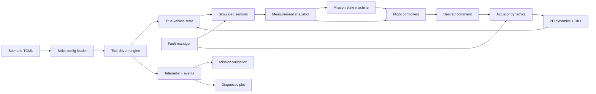

# AstraLoop

> Python Software-in-the-Loop Flight Control & Validation System

AstraLoop is a local Python simulation and validation system for a simplified 2D reusable vehicle. Autonomous flight software controls numerical physics using imperfect sensor measurements and is exercised through reproducible nominal and fault-injected missions.

> The rocket is the domain. The hiring signal is the software engineering.

- Deterministic fixed-step RK4 simulation with an integer-tick clock
- Hard separation between simulator truth and flight-software measurements
- Stateful PID control, actuator lag, mission modes, and typed fault injection
- Structured telemetry, objective validation, and headless diagnostic plots
- Layered unit, integration, architecture, scenario, and numerical-reference tests

```bash
python -m astraloop run scenarios/nominal.toml
```

## Why this project exists

How can autonomous control software be tested without physical hardware? AstraLoop builds a deterministic software-in-the-loop environment around that question. It combines continuous numerical dynamics with discrete software timing, imperfect inputs, physical actuator constraints, explicit mission states, reproducible failures, and post-run test oracles.

The project targets systems, simulation, validation, software-test, and hardware-adjacent software engineering roles. It is intentionally not a SaaS application, high-fidelity launch-vehicle model, 6-DOF research simulator, or scripted animation.

## How it works



The controller and mission logic never receive `VehicleState`. They consume `MeasurementSnapshot`, whose values may be noisy, biased, delayed, frozen, unavailable, or stale. The validator is a separate test oracle and uses recorded simulator truth to determine what physically happened.

Simulation time is derived from an integer tick:

```python
sim_time = tick * dt
```

There is no wall-clock sleeping in physics, sensor delay, controller cadence, or fault timing.

## Scenarios

| Scenario | Declared expected outcome | Purpose |
|---|---|---|
| `nominal` | `pass` | Complete autonomous mission without injected faults |
| `altimeter_freeze` | `controlled_abort` | Freeze a critical altitude channel |
| `velocity_bias` | `validation_fail` | Bias the vertical-velocity feedback signal |
| `sensor_delay` | `validation_fail` | Increase altimeter latency at an exact tick |
| `degraded_actuator` | `validation_fail` | Slow and rate-limit physical actuator response |

Scenario outcomes are contracts, not hard-coded behavior. An expected controlled abort or validation failure can pass its regression contract when the actual outcome matches and the configured fault genuinely activated.

List the bundled configurations with:

```bash
python -m astraloop list-scenarios
```

## Run artifacts

A persisted run creates an immutable local bundle under `runs/<scenario>/`:

```text
telemetry.csv
events.json
resolved_config.json
summary.json
flight_plot.png
```

Telemetry aligns truth, measurements, mission mode, desired commands, applied actuation, and active faults on one deterministic tick axis. Events record sparse mission transitions and fault lifecycle changes. The plot presents trajectory, truth-versus-measurement signals, controller targets, requested-versus-actual actuation, and fault timing in one six-panel engineering view.

Use `--no-artifacts` for an in-memory-only run or choose a root with `--artifact-root PATH`.

## Quick start

Python 3.11 or newer is required.

```bash
python -m venv .venv
.venv\Scripts\activate
python -m pip install -e ".[dev]"
python -m astraloop list-scenarios
python -m astraloop run scenarios/nominal.toml
```

On macOS or Linux, activate with `source .venv/bin/activate`.

## Testing and quality

The test suite is organized by engineering risk rather than a vanity coverage target:

```bash
pytest
pytest tests/unit
pytest tests/integration
pytest tests/scenarios
pytest tests/numerical
ruff check .
pyright
```

- Unit tests cover physics, RK4, sensors, PID, actuators, mission logic, faults, configuration, and validation.
- Integration tests cover subsystem timing and artifact handoffs.
- Scenario tests execute the same `run_scenario(...)` service used by the CLI.
- Architecture tests protect truth isolation and prohibit scenario-specific core branches.
- Numerical tests use analytical ODEs and SciPy as an independent development-only reference.

No test result or count is claimed here until the suite has been executed in the target environment.

## Numerical verification

The production runtime uses the project-owned fixed-step RK4 integrator because the simulation is hybrid continuous/discrete software. SciPy `solve_ivp` is restricted to development tests for smooth open-loop comparisons. Verification covers direct stage semantics, analytical solutions, step refinement, real seven-state dynamics, and timestep sensitivity.

See [Numerical Verification](docs/NUMERICAL_VERIFICATION.md) for the supported scope and limitations.

## Key design decisions

| Decision | Reason |
|---|---|
| Planar 2D rather than 6-DOF | Preserves meaningful coupled dynamics while keeping focus on software architecture and validation |
| Measurements instead of truth | Forces flight software to handle uncertainty, timing, and sensor health |
| Fixed tick and custom RK4 | Gives all continuous and discrete subsystems one reproducible timing model |
| Desired vs applied commands | Makes actuator bounds, lag, and degradation physical rather than cosmetic |
| Typed TOML scenarios | Adds new supported cases without engine source edits |
| Truth-based post-run validation | Keeps the test oracle independent from imperfect flight-software inputs |
| CSV/JSON/PNG artifacts | Makes every run inspectable without a database or hosted service |

## Repository structure

```text
src/astraloop/
├── actuators/     physical command response
├── config/        strict TOML resolution
├── control/       measurement-driven PID control
├── faults/        typed fault lifecycle and composition
├── mission/       explicit finite-state machine
├── model/         shared immutable domain records
├── scenarios/     discovery and application runner
├── sensors/       sampling, noise, delay, freeze, stale state
├── simulation/    dynamics, RK4, deterministic engine
├── telemetry/     recording, artifacts, diagnostic plotting
└── validation/    objective post-run checks

scenarios/         five curated mission configurations
tests/             unit, integration, scenario, architecture, numerical
docs/              technical design and portfolio walkthroughs
```

## Known limitations and non-goals

- Simplified planar rigid-body equations; no aerodynamic drag or atmospheric model
- Constant moment of inertia and simplified mass-flow model
- Raw simulated measurements; no Kalman filter or sensor fusion
- Project-scale PID control rather than optimal guidance
- No 3D/6-DOF, orbital mechanics, staging, CFD, or real vehicle fidelity
- No hardware-in-the-loop, real-time guarantees, GUI, database, cloud service, or web dashboard
- Numerical support is limited to the documented model and parameter envelope

## Future improvements

After the current deterministic suite is executed and calibrated, sensible extensions include a small horizontal guidance loop, optional disturbance scenario, Monte Carlo campaign wrapper, and hardware-in-the-loop adapter. None is required to understand the current software architecture.

## Documentation

- [Project brief](docs/PROJECT_BRIEF.md)
- [Architecture and tick ordering](docs/ARCHITECTURE.md)
- [Feature index](docs/FEATURE_INDEX.md)
- [Roadmap](docs/ROADMAP.md)
- [Testing strategy](docs/TESTING_STRATEGY.md)
- [Numerical verification](docs/NUMERICAL_VERIFICATION.md)
- [Build log](docs/BUILD_LOG.md)
- [Demo script](docs/DEMO_SCRIPT.md)
- [Interview story](docs/INTERVIEW_STORY.md)

## What I learned

- Hybrid simulations need one explicit timing contract before subsystems are integrated.
- Command, applied actuation, and physical truth must remain distinct to make degradation observable.
- Expected failures need separate mission-outcome and regression-result semantics.
- Telemetry becomes far more useful when every event and frame shares an integer-tick source of time.
